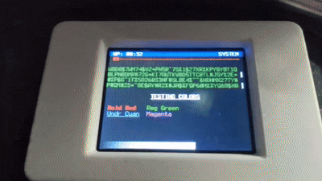

# mpy_vt: Optimized ANSI Terminal Engine for MicroPython

This project implements a high-performance, attribute-aware terminal emulator for MicroPython. By wrapping the [st](https://st.suckless.org/) (suckless terminal) engine in a custom C module, it achieves desktop-class terminal features on embedded hardware.




## 🚀 Features

### **Core Terminal Capabilities**
* **Full `st` (Suckless Terminal) Core:** Leveraging a battle-tested terminal engine for industrial-grade ANSI escape sequence parsing.
* **Dynamic VT100/ANSI Support:** Support for standard terminal commands, including cursor positioning, screen clearing, and scrolling regions.
* **Hardware-Accelerated Rendering:** C-based scanline buffering that maximizes SPI throughput and eliminates screen tearing.

### **Dirty-Line Tracking & Optimization**
Unlike standard display drivers that refresh the entire screen for every character, `mpy_vt` utilizes the `st` engine's internal dirty-line bitmask:
* **Selective Redrawing:** Only modified rows are sent over SPI. Typing a single character updates only **1/20th** (or less) of the screen.
* **Atomic Windowing:** Uses hardware-level address windowing (`CASET`/`RASET`) to update specific horizontal slices, significantly reducing bus contention.

## **Zero-Allocation Status Bar**
* **Zero Memory Fragmentation**: The status bar's memory usage is a "flat line." It never grows, and it never needs to be cleaned up.
* **Zero Latency Jitter**: Since the Garbage Collector isn't triggered by the status bar, your UI stays consistently responsive. No "stuttering" every 30 seconds.
* **Native ANSI Rendering**: ANSI escape sequences are embedded directly into the bytearray at initialization. The C engine treats the entire bar as a single, pre-styled memory block, allowing for instant, flicker-free UI updates with zero overhead for color or positioning logic.


## 🧩 Modules

This project is composed of five specialized modules that work in tandem to create a full system console.

| Module | Role | Stream Type | Description |
| :---   | :--- | :--- | :--- |
| `st7789` | Display Driver | N/A | Modified version of the standard driver. Exposes internal frame buffer pointers to vt for direct-memory access (DMA) rendering. |
| `vt` | Terminal Engine | Writable | "The core emulator. Receives ANSI text, updates internal state, and renders changes to the st7789 display." |
| `tdeck_kbd` | Input Driver | Readable | Low-level driver for the T-Deck I2C keyboard/trackball. Handles key scanning and interrupt flags. |
| `tdeck_trk` | Motion Engine | Interrupts | Low-level driver for the T-Deck trackball. Uses GPIO interrupts to track relative motion (deltas) and supports edge-detection for short/long click durations. |
| `tdeck_kvm` | Stream Glue | Read/Write | "A composite Keyboard-Video-Mouse (trackball) object. It binds vt (Output) and tdeck_kbd (Input) into a single stream object compatible with os.dupterm." |


## 📟 Supported Hardware: LILYGO T-Deck

This project includes a tuned configuration specifically for the LILYGO T-Deck, optimizing for its unique hardware layout and memory capabilities.


## 🔌 MicroPython REPL Integration

To attach the T-Deck hardware to the MicroPython REPL, we use the tdeck_kv glue module. This ensures that stdout (print statements) goes to the visual terminal, while stdin (typing) is pulled from the keyboard driver.

**Note**: The `vt` module can be used alone on other systems with an `st7789` compatible display. You can send a vt instance to `os.dupterm`

```python
import terminus_mpy_regular as rfont
import terminus_mpy_bold as bfont
import machine
import vt
import tdeck_kbd
import tdeck_kvm
import os
import network
import time
import st7789
import time

# Screen dimensions in pixel
screen_width = 320
screen_height = 240

# How many characters can we fit on the screen
rows = screen_height // rfont.HEIGHT
cols = screen_width // rfont.WIDTH

# Must be called before initializing LCD / Keyboard
pwr_en = machine.Pin(10, machine.Pin.OUT)
pwr_en.value(1)
time.sleep(0.1)

# Initialze LCD
spi = machine.SPI(2, baudrate=40000000, sck=machine.Pin(40), mosi=machine.Pin(41))
tft = st7789.ST7789(spi,
    screen_height,
    screen_width,
    reset=machine.Pin(1, machine.Pin.OUT),
    dc=machine.Pin(11, machine.Pin.OUT),
    cs=machine.Pin(12, machine.Pin.OUT),
    backlight=machine.Pin(42, machine.Pin.OUT),
    rotation=1,
    buffer_size=screen_width*rfont.HEIGHT*2)
tft.init()

# Initialize ST engine (Output Stream)
term = vt.VT(tft, cols, rows, rfont, bfont)

# Initialize keyboard (Input Stream)
kbd = tdeck_kbd.Keyboard(sda=18, scl=8)

# Combine ST & keyboard into one stream object
kvm = tdeck_kvm.KVM(term , kbd)

# Redirect to REPL
os.dupterm(kvm)

# Update LCD periodically
def refresh_loop(timer):
    term.draw()

# 30ms = ~33 FPS.
refresh_timer = machine.Timer(0)
refresh_timer.init(period=30, mode=machine.Timer.PERIODIC, callback=refresh_loop)

```


## 🛠️ API Reference

### **1. `vt.VT` (Terminal Engine)**
*The logic core. Handles ANSI escape sequences, character attributes, and buffer management.*

| Method | Parameters | Description |
| :--- | :--- | :--- |
| **`VT()`** | `display, cols, rows, font, [bold]` | **Constructor.** Requires an initialized `st7789` object, column/row counts, and at least one font module. |
| **`write()`** | `data` | Feeds ANSI strings or raw bytes into the parser. Updates internal state and marks lines as "dirty." |
| **`draw()`** | *None* | Triggers the render pass. Iterates through dirty lines and pushes pixel data to the `st7789` hardware. |
| **`ioctl()`** | `cmd, arg` | Internal stream protocol implementation for `os.dupterm` compatibility. |
| **`top_offset(px)`** | `px` (int) | Sets the vertical starting point of the terminal in pixels. Allows reserving space for a top status bar. |
| **`top_bar(text)`** | `text` | Parses ANSI and renders at the very top of the display. |
| **`bottom_bar(text)`** | `text` | Parses ANSI and renders at the very last row of the display. |
| **`top_bar_invalidate()`** | *None | Forces the top bar to redraw on the next update call. |
| **`bottom_bar_invalidate()`** | *None | Forces the bottom bar to redraw on the next update call. |


### **2. `tdeck_kbd.Keyboard` (Input Driver)**
*The hardware interface for the T-Deck's I2C-based keyboard and trackball.*

| Method | Parameters | Description |
| :--- | :--- | :--- |
| **`Keyboard()`** | `sda, slc` | **Constructor.** Takes both sda and slc pin numbers. |
| **`read()`** | `n` | Reads up to `n` bytes from the keyboard buffer. Returns `None` if no keys are pressed. |
| **`ioctl()`** | `cmd, arg` | Handles polling requests; used by the system to check for pending input without blocking. |

### **3. `tdeck_trk` (Trackball Driver)**
*Low-level motion engine that handles GPIO interrupts for the T-Deck trackball and click-duration logic.*

| Method | Parameters | Description |
| :--- | :--- | :--- |
| **`init()`** | None | **Initializer.** Configures GPIO pins, enables internal pull-ups, and attaches the high-frequency Interrupt Service Routine (ISR) to the motion and click pins. |
| **`get_scroll_vert()`** | None | Returns an **integer** representing the vertical movement delta since the last call. Resets the internal counter to zero upon reading. |
| **`get_scroll_horiz()`** | None | Returns an **integer** representing the horizontal movement delta since the last call. Resets the internal counter to zero upon reading. |
| **`get_click()`** | None | Returns **`True`** only on a "Short Press" release (20ms to 500ms). If a "Long Press" (>500ms) is detected, it internally triggers a hardware-level `KeyboardInterrupt`. |

### **4. `tdeck_kvm.KVM` (Stream Glue)**
*The virtual wrapper that binds separate Input and Output hardware into a single duplex stream.*

| Method | Parameters | Description |
| :--- | :--- | :--- |
| **`KVM()`** | `vt_obj, kbd_obj` | **Constructor.** Links a `vt` instance (Output) with a `tdeck_kbd` instance (Input). |
| **`read()`** | `n` | Redirects the request to the linked `kbd_obj.read(n)`. |
| **`write()`** | `buf` | Redirects the request to the linked `vt_obj.write(buf)`. |
| **`inject()`** | `data` | **Macro Injection.** Accepts a string or bytes and places them into the high-priority ring buffer to be read by the REPL or active application. |
| **`ioctl()`** | `cmd, arg` | Aggregates status from both objects (e.g., checks if KBD has data or if VT is ready). |

### **5. `st7789` (Modified Display Driver)**
*Standard display driver with specific C-layer extensions for terminal performance.*

| Feature | Type | Description |
| :--- | :--- | :--- |
| **Standard API** | Methods | Retains full compatibility with `fill()` and `pixel()` for drawing non-terminal UI elements. |

## ⚖️ License & Attribution

This project is licensed under the **MIT License**.

### Third-Party Components:
* **st License:** MIT (c) st engineers.
* **st7789_mpy:** (c) Russ Hughes. [MIT License]

### Fonts & Assets:
* **Terminus Font:** (c) 2020 Dimitar Zhekov. Licensed under the [SIL Open Font License 1.1](https://scripts.sil.org/OFL).
