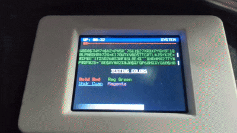
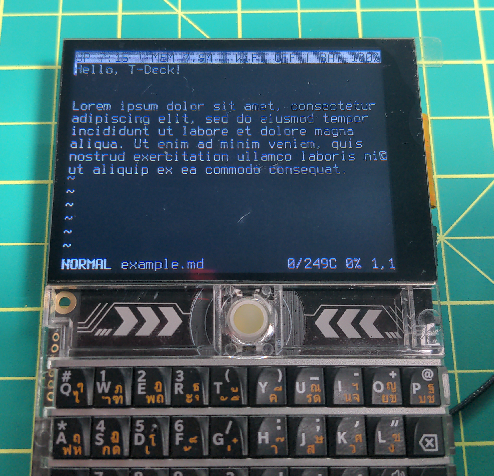
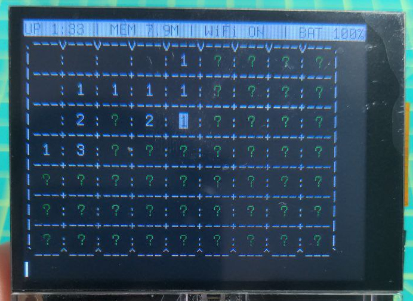
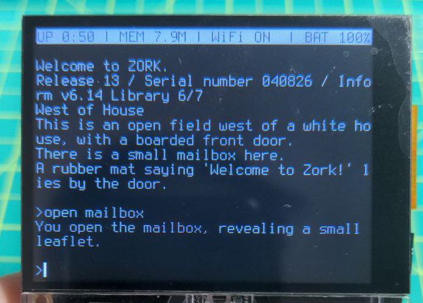

# mpy_vt: Optimized ANSI Terminal Engine for MicroPython

This project implements a high-performance, attribute-aware terminal emulator for MicroPython. By wrapping the [st](https://st.suckless.org/) (suckless terminal) engine in a custom C module, it achieves desktop-class terminal features on embedded hardware, including a **zero-allocation status bar** for real-time telemetry without heap fragmentation. Unlike basic serial monitors, it handles complex escape sequences, colors, and text attributes with the efficiency and speed characteristic of suckless software.

This project now features first-class support for the **LILYGO T-Deck**, transforming it into a standalone portable terminal. The integration leverages the T-Deck’s hardware keyboard, trackball and 320x240 display, utilizing the ESP32-S3's PSRAM to manage the terminal's backbuffer and state.

As a showcase of the engine's capabilities, this project includes a fully functional, VFS-aware C port of the `vi` **text editor**. Furthermore, it provides a Python-based **Telnet client**, demonstrating how the terminal engine can be easily extended to create networked applications.

| ASCII demo (running on CYD) | vi app |
| :---: | :---: |
|  |  |

| Minesweeper (telnet) | Zork (telnet) |
| :---: | :---: |
|  |  |


## ⚡ Quick Install (Pre-compiled Binaries)

Don't want to set up a build environment? You can download and flash the latest pre-compiled firmware directly to your T-Deck.

### Option A: Flash from command line

1. **Download the Firmware**: Go to the [Releases Page](https://github.com/8bitmcu/mpy_vt/releases) and download the latest *.bin asset.

2. **Flash to the T-Deck**: Make sure your T-Deck is plugged in via USB, then use esptool.py to write the firmware to the device. You may need to install esptool first (`pip install esptool`).

```Bash

esptool.py -p /dev/ttyACM0 -b 460800 --chip esp32s3 write_flash 0x0 firmware.bin

```

### Option B: Bootloader (Launcher)

This firmware is fully compatible with [Launcher](https://bmorcelli.github.io/Launcher), an on-device application launcher and bootloader for ESP32 devices. This method is perfect if you want to seamlessly swap between `mpy_vt` and other firmware on the go without needing a PC.

1. **Install Launcher**: Open a Web Serial compatible browser (like Chrome or Edge) and navigate to the Launcher website. Select Web Flasher and follow the prompts to install the bootloader directly to your T-Deck.
2. **Prepare your SD Card**: Download the latest *.bin from the Releases Page and copy it to a MicroSD card.
3. **Boot and Install**: Insert the MicroSD card into your T-Deck and power it on. Using the Launcher interface on the device's screen, navigate to your SD card and select the `mpy_vt` binary to flash it.

## 📝 How to use

### Trackball Usage
- **Short Press**: Sends `Esc`
- **Long Press**: Sends `KeyboardInterrupt`
- **Scroll up**: Scroll up st terminal history
- **Scroll down**: Scroll down st terminal history
- **Scroll left**: Scroll up st command history
- **Scroll right**: Scroll down st command history

### Available commands

You can execute the following commands directly in the MicroPython REPL:

| Command | Description |
| :---   | :--- |
| `nm` | Starts the Network Manager TUI |
| `vi` | Opens example.md (with content) within the vi port |
| `leak` | Check for MicroPython memory leaks |
| `clear` | Clears the screen |
| `telehack` | Connects telnet to telehack.com |
| `retrocampus` | Connects telnet to bbs.retrocampus.com |

## 🚀 VT Features

### **Core Terminal Capabilities**
* **Full `st` (Suckless Terminal) Core:** Leveraging a battle-tested terminal engine for industrial-grade ANSI escape sequence parsing.
* **Dynamic VT100/ANSI Support:** Support for standard terminal commands, including cursor positioning, screen clearing, and scrolling regions.
* **Hardware-Accelerated Rendering:** C-based scanline buffering that maximizes SPI throughput and eliminates screen tearing.

### **Dirty-Line Tracking & Optimization**
Unlike standard display drivers that refresh the entire screen for every character, `mpy_vt` utilizes the `st` engine's internal dirty-line bitmask:
* **Selective Redrawing:** Only modified rows are sent over SPI. Typing a single character updates only **1/20th** (or less) of the screen.
* **Atomic Windowing:** Uses hardware-level address windowing (`CASET`/`RASET`) to update specific horizontal slices, significantly reducing bus contention.

### **Zero-Allocation Status Bar**
* **Zero Memory Fragmentation**: The status bar's memory usage is a "flat line." It never grows, and it never needs to be cleaned up.
* **Zero Latency Jitter**: Since the Garbage Collector isn't triggered by the status bar, your UI stays consistently responsive. No "stuttering" every 30 seconds.
* **Native ANSI Rendering**: ANSI escape sequences are embedded directly into the bytearray at initialization. The C engine treats the entire bar as a single, pre-styled memory block, allowing for instant, flicker-free UI updates with zero overhead for color or positioning logic.


## 🧩 Modules

This project is composed of six specialized modules that works in tandem:

| Module | Role | Stream Type | Description |
| :---   | :--- | :--- | :--- |
| `st7789` | Display Driver | N/A | Modified version of the standard driver. Exposes internal frame buffer pointers to vt for direct-memory access (DMA) rendering. |
| `vt` | Terminal Engine | Writable | The core emulator. Receives ANSI text, updates internal state, and renders changes to the st7789 display. |
| `tdeck_kbd` | Input Driver | Readable | Low-level driver for the T-Deck I2C keyboard/trackball. Handles key scanning and interrupt flags. |
| `tdeck_trk` | Motion Engine | Interrupts | Low-level driver for the T-Deck trackball. Uses GPIO interrupts to track relative motion (deltas) and supports edge-detection for short/long click durations. |
| `tdeck_kvm` | Stream Glue | Read/Write | A composite Keyboard-Video-Mouse (trackball) object. It binds vt (Output) and tdeck_kbd (Input) into a single stream object compatible with os.dupterm. |
| `vi` | Text Editor | Read/Write | A C-integrated port of the classic `vi` editor. |


## 📟 T-Deck Hardware Integration

This project is optimized for the **LilyGO T-Deck**, leveraging MicroPython to interface with the ESP32-S3 and its integrated peripherals.

### 🛠 Supported Components

| Component | Specification | Driver / Status |
| :--- | :--- | :--- |
| **Display** | 2.4" ST7789 LCD (320x240) | Optimized SPI bus (Full Color) |
| **Input** | LILYGO Keyboard & Trackball | Fully Mapped I2C Interface |
| **Memory** | 8MB PSRAM / 16MB Flash | Enabled for Large Buffer Handling |

## 🔌 MicroPython REPL Integration

To attach the T-Deck hardware to the MicroPython REPL, we use the tdeck_kv glue module. This ensures that stdout (print statements) goes to the visual terminal, while stdin (typing) is pulled from the keyboard driver.

**Note**: The `vt` module can be used alone on other systems with an `st7789` compatible display. You can send a vt instance to `os.dupterm`

```python
import terminus_mpy_regular as rfont
import terminus_mpy_bold as bfont
import machine
import vt
import tdeck_kbd
import tdeck_kvm
import os
import network
import time
import st7789
import time

# Screen dimensions in pixel
screen_width = 320
screen_height = 240

# How many characters can we fit on the screen
rows = screen_height // rfont.HEIGHT
cols = screen_width // rfont.WIDTH

# Must be called before initializing LCD / Keyboard
pwr_en = machine.Pin(10, machine.Pin.OUT)
pwr_en.value(1)
time.sleep(0.1)

# Initialze LCD
spi = machine.SPI(2, baudrate=40000000, sck=machine.Pin(40), mosi=machine.Pin(41))
tft = st7789.ST7789(spi,
    screen_height,
    screen_width,
    reset=machine.Pin(1, machine.Pin.OUT),
    dc=machine.Pin(11, machine.Pin.OUT),
    cs=machine.Pin(12, machine.Pin.OUT),
    backlight=machine.Pin(42, machine.Pin.OUT),
    rotation=1,
    buffer_size=screen_width*rfont.HEIGHT*2)
tft.init()

# Initialize ST engine (Output Stream)
term = vt.VT(tft, cols, rows, rfont, bfont)

# Initialize keyboard (Input Stream)
kbd = tdeck_kbd.Keyboard(sda=18, scl=8)

# Combine ST & keyboard into one stream object
kvm = tdeck_kvm.KVM(term , kbd)

# Redirect to REPL
os.dupterm(kvm)

# Update LCD periodically
def refresh_loop(timer):
    term.draw()

# 30ms = ~33 FPS.
refresh_timer = machine.Timer(0)
refresh_timer.init(period=30, mode=machine.Timer.PERIODIC, callback=refresh_loop)
```

## 🔨 How to Build (T-Deck)

### Option A: Building on Host machine

Building this project requires a cross-compiler for the ESP32-S3 and the MicroPython source tree. Ensure you have the ESP-IDF (Espressif IoT Development Framework) installed. This project is verified using **MicroPython v1.28.0** and **ESP-IDF v5.5.1**.

```bash
# Clone this repository
git clone https://github.com/8bitmcu/mpy_vt.git

# Copy the T-Deck board definition into your micropython source directory:
cp -r /path/to/mpy_vt/boards/LILYGO_T_DECK /path/to/micropython/ports/esp32/boards/

# Initialize the ESP-IDF environment
source $HOME/esp/esp-idf/export.sh

# Build the MicroPython Cross-Compiler
make -C /path/to/micropython/mpy-cross

# Navigate to the T-Deck port directory.
cd /path/to/micropython/ports/esp32

# Specify the BOARD as LILYGO_T_DECK to enable PSRAM / Flash support
# Specify USER_C_MODULES and FROZEN_MANIFEST for C modules and python scripts
make BOARD=LILYGO_T_DECK USER_C_MODULES=/path/to/mpy_vt/modules FROZEN_MANIFEST=/path/to/mpy_vt/modules/manifest.py

# Flash the firmware to the device
esptool.py -p /dev/ttyACM0 -b 460800 --chip esp32s3 write_flash 0x0 firmware.bin
```

### Option B: Building using Docker and Makefile

You do not need to install the ESP-IDF, toolchains, or MicroPython source code on your host machine if you have `Docker` and `Make` installed.

#### Prerequisites:

- Docker installed and running.
- Make installed on your host system.
- A Linux environment (or WSL2 on Windows) that allows USB device passthrough to Docker.

If you just want to build and flash the firmware, run these commands in order:


```Bash

# 1. Clone this repository and enter in it
git clone https://github.com/8bitmcu/mpy_vt.git && cd mpy_vt

# 2. Initialize the environment (pulls MicroPython source)
make init

# 3. Compile the firmware
make build

# 4. Flash to the device (ensure your T-Deck is plugged in)
make flash
```
#### Makefile Reference

`make init` sets up the pristine build environment. Builds the necessary local Docker image (micropython-build) and creates a persistent Docker volume. It then clones MicroPython and its submodules directly into that volume. Run this once when setting up the project, or to force a fresh pull of the MicroPython source.

`make build` compiles the MicroPython firmware. Mounts your local boards/ and modules/ directories into the ESP-IDF container. It compiles the C-level modules, freezes your Python manifests, and builds the target specifically for the LILYGO_T_DECK. Outputs: The compiled binaries (firmware.bin, micropython.bin) will appear in your local `build_output/` folder.

`make flash` flashes the compiled firmware to the ESP32-S3. Uses `esptool.py` inside the container to erase the flash and write the new firmware.bin to address 0x0.

`make sync_files` transfers your Python application code to the device. Uses `mpremote` to recursively copy everything inside ./modules/scripts/ into the root of the T-Deck's internal flash filesystem.

`make repl` opens the MicroPython interactive prompt. Connects your terminal to the device's serial output via mpremote. Press Ctrl+D inside the REPL to trigger a soft reboot, or Ctrl+] to exit back to your host terminal.

`make core_dump` analyzes fatal crashes. If your device crashes and enters a bootloop or halts, this command reads the raw coredump partition directly from the flash and maps it against the .elf file in your build volume to provide a human-readable C-level stack trace.

`make clean` cleans the build artifacts. Removes the compiled object files from the Docker volume and deletes the local build_output/ folder to ensure your next make build starts completely fresh.

#### Overriding Variables

The Makefile defaults to /dev/ttyACM0 for the USB connection. If your OS assigns a different port (e.g., /dev/ttyUSB0), you can override it inline without editing the Makefile:

```Bash
make flash PORT=/dev/ttyUSB0
make repl PORT=/dev/ttyUSB0
```

## 🛠️ API Reference

### **1. `vt.VT` (Terminal Engine)**
*The logic core. Handles ANSI escape sequences, character attributes, and buffer management.*

| Method | Parameters | Description |
| :--- | :--- | :--- |
| **`VT()`** | `display, cols, rows, font, [bold]` | **Constructor.** Requires an initialized `st7789` object, column/row counts, and at least one font module. |
| **`write()`** | `data` | Feeds ANSI strings or raw bytes into the parser. Updates internal state and marks lines as "dirty." |
| **`draw()`** | *None* | Triggers the render pass. Iterates through dirty lines and pushes pixel data to the `st7789` hardware. |
| **`ioctl()`** | `cmd, arg` | Internal stream protocol implementation for `os.dupterm` compatibility. |
| **`top_offset(px)`** | `px` (int) | Sets the vertical starting point of the terminal in pixels. Allows reserving space for a top status bar. |
| **`top_bar(text)`** | `text` | Parses ANSI and renders at the very top of the display. |
| **`bottom_bar(text)`** | `text` | Parses ANSI and renders at the very last row of the display. |
| **`top_bar_invalidate()`** | *None | Forces the top bar to redraw on the next update call. |
| **`bottom_bar_invalidate()`** | *None | Forces the bottom bar to redraw on the next update call. |


### **2. `tdeck_kbd.Keyboard` (Input Driver)**
*The hardware interface for the T-Deck's I2C-based keyboard and trackball.*

| Method | Parameters | Description |
| :--- | :--- | :--- |
| **`Keyboard()`** | `sda, slc` | **Constructor.** Takes both sda and slc pin numbers. |
| **`read()`** | `n` | Reads up to `n` bytes from the keyboard buffer. Returns `None` if no keys are pressed. |
| **`ioctl()`** | `cmd, arg` | Handles polling requests; used by the system to check for pending input without blocking. |

### **3. `tdeck_trk` (Trackball Driver)**
*Low-level motion engine that handles GPIO interrupts for the T-Deck trackball and click-duration logic.*

| Method | Parameters | Description |
| :--- | :--- | :--- |
| **`init()`** | None | **Initializer.** Configures GPIO pins, enables internal pull-ups, and attaches the high-frequency Interrupt Service Routine (ISR) to the motion and click pins. |
| **`get_scroll_vert()`** | None | Returns an **integer** representing the vertical movement delta since the last call. Resets the internal counter to zero upon reading. |
| **`get_scroll_horiz()`** | None | Returns an **integer** representing the horizontal movement delta since the last call. Resets the internal counter to zero upon reading. |
| **`get_click()`** | None | Returns **`True`** only on a "Short Press" release (20ms to 500ms). If a "Long Press" (>500ms) is detected, it internally triggers a hardware-level `KeyboardInterrupt`. |

### **4. `tdeck_kvm.KVM` (Stream Glue)**
*The virtual wrapper that binds separate Input and Output hardware into a single duplex stream.*

| Method | Parameters | Description |
| :--- | :--- | :--- |
| **`KVM()`** | `vt_obj, kbd_obj` | **Constructor.** Links a `vt` instance (Output) with a `tdeck_kbd` instance (Input). |
| **`read()`** | `n` | Redirects the request to the linked `kbd_obj.read(n)`. |
| **`write()`** | `buf` | Redirects the request to the linked `vt_obj.write(buf)`. |
| **`inject()`** | `data` | **Macro Injection.** Accepts a string or bytes and places them into the high-priority ring buffer to be read by the REPL or active application. |
| **`ioctl()`** | `cmd, arg` | Aggregates status from both objects (e.g., checks if KBD has data or if VT is ready). |

### **5. `vi.Vi` (Text Editor)**
*Port of the classic `vi` text-editor.*

| Method | Parameters | Description |
| :--- | :--- | :--- |
| **`Vi()`** | `filename, stream, cols, rows` | **Constructor.** Launches the vi editor, opening a given filename, using `stream` for input/outputs. |

### **6. `st7789` (Modified Display Driver)**
*Standard display driver with specific C-layer extensions for terminal performance.*

| Feature | Type | Description |
| :--- | :--- | :--- |
| **Standard API** | Methods | Retains full compatibility with `fill()` and `pixel()` for drawing non-terminal UI elements. |

## ⚖️ License & Attribution

This project is licensed under the **MIT License**.

### Third-Party Components:
* **st License:** MIT (c) st engineers.
* **st7789_mpy:** (c) Russ Hughes. MIT License
* **vi** (Toybox): (c) Rob Landley, Jarno Mäkipää. 0BSD License (Zero-Clause BSD).
* **MicroPython**: (c) Damien P. George. MIT License.

### Fonts & Assets:
* **Terminus Font:** (c) 2020 Dimitar Zhekov. Licensed under the [SIL Open Font License 1.1](https://scripts.sil.org/OFL).
